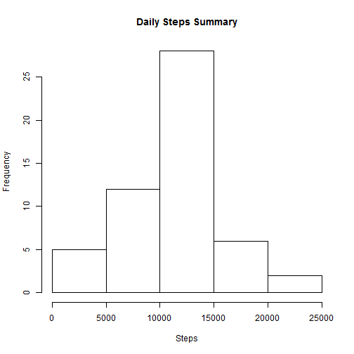
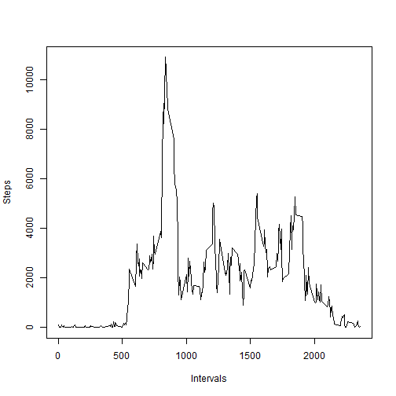
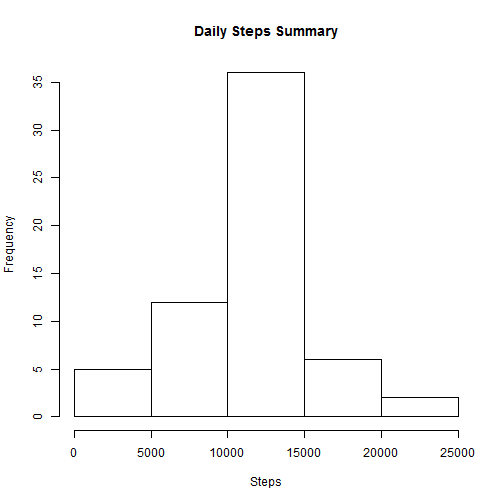
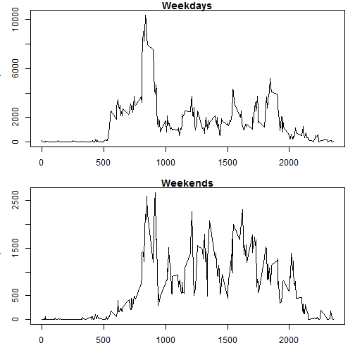

## Loading and preprocessing the data
Download, unzip, and load the data

```r
# Download archive file, if it does not exist
ActivityFile <- "data/activity.zip"
if(!file.exists(ActivityFile)) {
  FileURL <- "http://d396qusza40orc.cloudfront.net/repdata%2Fdata%2Factivity.zip"
  download.file(url=FileURL,destfile=ActivityFile) #, method="curl" for Mac
}

# Unzip the downloaded file
unzip(zipfile=ActivityFile, overwrite=T, exdir="data")

# Load the CSV File
ActivityFile <- "data/activity.csv"
activity <- read.csv(ActivityFile, header=T, sep=",")
```

Make the text date field a Date data type field, and make a seperate copy of the data excluding the missing records.

```r
# Make the date field a Date data type
activity$date<-as.Date(activity$date,format="%Y-%m-%d")

#Make a seperate subset of the data w/o the NA records
activity.na.omit <- na.omit(activity) 
```

## What is mean total number of steps taken per day?
We have aggregated the data by date and plotted them in a Histogram

```r
df<- aggregate(activity.na.omit$steps,by=list(activity.na.omit$date),FUN=sum)
names(df)=c("Date","DailySteps")
hist(df$DailySteps,xlab="Steps", main="Daily Steps Summary")
```

 

Find hereunder the Mean and Median

```r
m<-as.data.frame(mean(df$DailySteps,na.rm=T))
m<-cbind(m,median(df$DailySteps,na.rm=T))
names(m)<-c("Mean","Median")
m
```

```
##       Mean Median
## 1 10766.19  10765
```

## What is the average daily activity pattern?
Now let's plot the activity by interval

```r
df<- aggregate(activity.na.omit$steps,by=list(activity.na.omit$interval),FUN=sum)
names(df)=c("Interval","Steps")
plot(x=df$Interval,y=df$Steps,type="l",xlab="Intervals",ylab="Steps")
```

 

Checking which interval has the highest activity level

```r
HiAct<-subset(df,Steps==max(df$Steps))
```
The 835 interval has the Highest activity level of 10927 steps

## Imputing missing values
To count the NAs, simply substract the number of rows excluding the nulls from the full data

```r
na.Count<-nrow(activity)-nrow(activity.na.omit)
```
There are 2304 missing values

We'll use the rounded mean of the time interval as the NA filler

```r
df<- aggregate(activity.na.omit$steps,by=list(activity.na.omit$interval),FUN=mean)
names(df)=c("interval","FillerSteps")
df$FillerSteps<-round(df$FillerSteps,0)
```

Replacing NA steps with the precalculated means

```r
activity.na.refill<-merge(activity,df)
activity.na.refill$steps<-with(activity.na.refill,
    ifelse(is.na(steps),FillerSteps,steps)
    )
activity.na.refill$FillerSteps<-NULL #drop the temp column
```

Replotting the previous Histogram, but this time using the replaced NAs

```r
df<- aggregate(activity.na.refill$steps,by=list(activity.na.refill$date),FUN=sum)
names(df)=c("Date","DailySteps")
hist(df$DailySteps,xlab="Steps", main="Daily Steps Summary")
```

 

and Recalculating the Mean and Median

```r
m2<-as.data.frame(mean(df$DailySteps,na.rm=T))
m2<-cbind(m2,median(df$DailySteps,na.rm=T))
names(m2)<-c("Mean","Median")
m2
```

```
##       Mean Median
## 1 10765.64  10762
```
*It seems like the NAs have a minimal inpact on the analysis*


## Are there differences in activity patterns between weekdays and weekends?
Analysing the difference between the activity on weekdays and weekends, we added the weekday, weekday index, and its type which seggregates the data between weekday and weekend.

```r
activity.days<-activity.na.refill
activity.days$strWD<-weekdays(activity.days$date)
activity.days$WD<-as.POSIXlt(activity.days$date)$wday
activity.days$DayType<-as.factor(with(activity.days, 
                          ifelse(WD==0|WD==6,"Weekend","Weekday")
                      ))
```

Let's draw the plots

```r
#storing the original plot parameters
old_mfrow=par()$mfrow
old_mar=par()$mar
par(mfrow = c(2, 1), mar=c(3,3,1,1))

dfWD<-subset(activity.days, DayType=="Weekday")
dfWE<-subset(activity.days, DayType=="Weekend")
dfWD<- aggregate(dfWD$steps,by=list(dfWD$interval),FUN=sum)
dfWE<- aggregate(dfWE$steps,by=list(dfWE$interval),FUN=sum)
names(dfWD)=c("Interval","Steps")
names(dfWE)=names(dfWD)
plot(x=dfWD$Interval,y=dfWD$Steps,type="l",xlab="Intervals",ylab="Steps", main="Weekdays")
plot(x=dfWE$Interval,y=dfWE$Steps,type="l",xlab="Intervals",ylab="Steps", main="Weekends")
```

 

```r
#resetting the parameters back
par(mfrow = old_mfrow, mar=old_mar)
```


